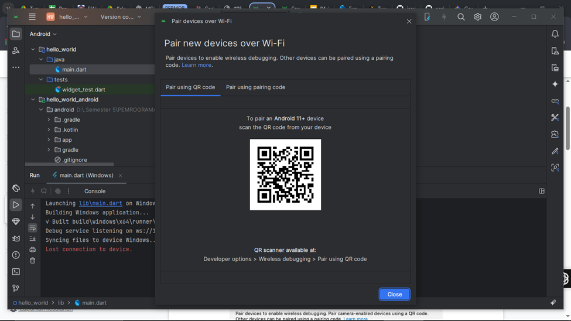

# hello_world

A new Flutter project.

## Getting Started

# Jobsheet 5 : Aplikasi Pertama dan Widget Dasar Flutter

## Praktikum 1: Membuat Project Flutter Baru

### Langkah 1
Buka **VS Code**, lalu tekan tombol **Ctrl + Shift + P** maka akan tampil **Command Palette**.  
Ketik `Flutter`, kemudian pilih **New Application Project**.  

---
### Langkah 2
Buat folder sesuai style laporan praktikum yang Anda pilih.  
Disarankan pada folder **Documents** atau **Desktop**, atau alamat folder lain yang tidak terlalu dalam/panjang.  
Lalu pilih **Select a folder to create the project in**.  

---

### Langkah 3
Beri nama project Flutter **hello_world** seperti berikut, lalu tekan **Enter**.  
Tunggu hingga proses pembuatan project baru selesai.  

---
### Langkah 4
Jika proses pembuatan project baru selesai, pastikan tampilan seperti berikut.  
Akan muncul pesan **"Your Flutter Project is ready!"** yang menandakan project berhasil dibuat.  

---
## Praktikum 2: Menghubungkan Perangkat Android atau Emulator

### Langkah 1
Mengaktifkan proses debug USB dan Menginstall Driver USB Google

---

### Langkah 2
Sambungkan perangkat Android ke komputer menggunakan kabel USB

---

### Langkah 3
Menjalankan aplikasi dari Android Studio di perangkat Android Menggunakan kabel USB

---

### Langkah 4
Langkah 4: Menjalankan aplikasi di perangkat Android menggunakan Wi-Fi dengan menghubungkan perangkat Android dan komputer ke jaringan nirkabel yang sama

---
