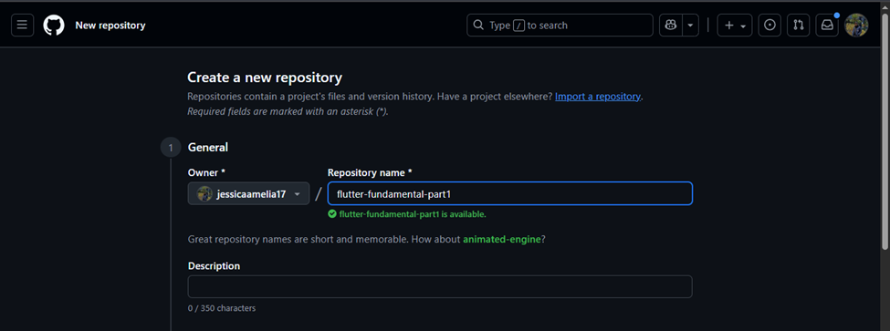

# hello_world

A new Flutter project.

## Getting Started

# Jobsheet 5 : Aplikasi Pertama dan Widget Dasar Flutter

## Praktikum 1: Membuat Project Flutter Baru

### Langkah 1
Buka **VS Code**, lalu tekan tombol **Ctrl + Shift + P** maka akan tampil **Command Palette**.  
Ketik `Flutter`, kemudian pilih **New Application Project**.  

---
### Langkah 2
Buat folder sesuai style laporan praktikum yang Anda pilih.  
Disarankan pada folder **Documents** atau **Desktop**, atau alamat folder lain yang tidak terlalu dalam/panjang.  
Lalu pilih **Select a folder to create the project in**.  

---

### Langkah 3
Beri nama project Flutter **hello_world** seperti berikut, lalu tekan **Enter**.  
Tunggu hingga proses pembuatan project baru selesai.  

---
### Langkah 4
Jika proses pembuatan project baru selesai, pastikan tampilan seperti berikut.  
Akan muncul pesan **"Your Flutter Project is ready!"** yang menandakan project berhasil dibuat.  

---
## Praktikum 2: Menghubungkan Perangkat Android atau Emulator

### Langkah 1
Mengaktifkan proses debug USB dan Menginstall Driver USB Google

---

### Langkah 2
Sambungkan perangkat Android ke komputer menggunakan kabel USB

---

### Langkah 3
Menjalankan aplikasi dari Android Studio di perangkat Android Menggunakan kabel USB

---

### Langkah 4
Langkah 4: Menjalankan aplikasi di perangkat Android menggunakan Wi-Fi dengan menghubungkan perangkat Android dan komputer ke jaringan nirkabel yang sama

---

## Praktikum 3: Membuat Repository GitHub dan Laporan Praktikum

### Langkah 1
Login ke akun GitHub Anda, lalu buat repository baru dengan nama "flutter-fundamental-part1"

---

### Langkah 2
Lalu klik tombol "Create repository" lalu akan tampil seperti gambar berikut.

---

### Langkah 3
Kembali ke VS code, project flutter hello_world, buka terminal pada menu Terminal > New Terminal. Lalu ketik perintah berikut untuk inisialisasi git pada project Anda.

---

### Langkah 4, Langkah 5, dan Langkah 6
Pilih menu Source Control di bagian kiri, lalu lakukan stages (+) pada file .gitignore untuk mengunggah file pertama ke repository GitHub.

Beri pesan commit "tambah gitignore" lalu klik Commit (✔)

Lakukan push dengan klik bagian menu titik tiga > Push

---

### Langkah 7 dan Langkah 8
Di pojok kanan bawah akan tampil seperti gambar berikut. Klik "Add Remote"

Salin tautan repository Anda dari browser ke bagian ini, lalu klik Add remote

Setelah berhasil, tulis remote name dengan "origin"

---

### Langkah 9 dan Langkah 10
Lakukan hal yang sama pada file README.md mulai dari Langkah 4. Setelah berhasil melakukan push, masukkan username GitHub Anda dan password berupa token yang telah dibuat (pengganti password konvensional ketika Anda login di browser GitHub). Reload halaman repository GitHub Anda, maka akan tampil hasil push kedua file tersebut seperti gambar berikut.

Lakukan push juga untuk semua file lainnya dengan pilih Stage All Changes. Beri pesan commit "project hello_world". Maka akan tampil di repository GitHub Anda seperti berikut.

---

### Langkah 11 dan Langkah 12
Kembali ke VS Code, ubah platform di pojok kanan bawah ke emulator atau device atau bisa juga menggunakan browser Chrome. Lalu coba running project hello_world dengan tekan F5 atau Run > Start Debugging. Tunggu proses kompilasi hingga selesai, maka aplikasi flutter pertama Anda akan tampil seperti berikut.

---

## Praktikum 4: Menerapkan Widget Dasar

### Langkah 1: Text Widget
Buat folder baru basic_widgets di dalam folder lib. Kemudian buat file baru di dalam basic_widgets dengan nama text_widget.dart. Ketik atau salin kode program berikut ke project hello_world Anda pada file text_widget.dart.

Lakukan import file text_widget.dart ke main.dart, lalu ganti bagian text widget dengan kode di atas. Maka hasilnya seperti gambar berikut. Screenshot hasil milik Anda, lalu dibuat laporan pada file README.md.

---

### Langkah 2: Image Widget
Buat sebuah file image_widget.dart di dalam folder basic_widgets dengan isi kode berikut.

Lakukan penyesuaian asset pada file pubspec.yaml dan tambahkan file logo Anda di folder assets project hello_world.

Jangan lupa sesuaikan kode dan import di file main.dart kemudian akan tampil gambar seperti berikut.
